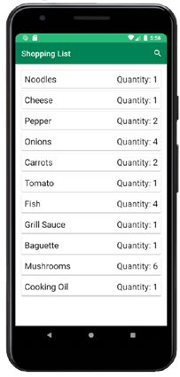
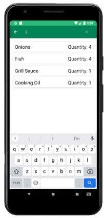

# Android App Library: RecyclerView with SearchView

## About
Welcome to our Android application. The app is part of the Open Sorce [Android App Library](https://github.com/LukPle/android-app-library.git) 
and adopts all licensing and community guidelines from this project. Please use the link in order to check out the corresponding repository.

The recyclerview-searchview app showcases the **RecyclerView** with elements of an **ArrayList**.
It is possible to search for specific items in the list by using a **SearchView**. The application serves as an example of these features.

## Features
The setting for this example is a shopping list. An ArrayList contains different items that need to be purchased. The items have a name and quantity.
The user can search for specific items via text in a search field.  

## Usage
You can clone the repository into Android Studio by clicking "Get from VCS" in the Welcome Screen or navigating to "File - New - Project from Version Control" inside 
the IDE. When doing so use the URL provided by GitHub. You can run the app on your mobile device or an emulator. Feel free to modify the code or utilize this sample 
for your own project.
